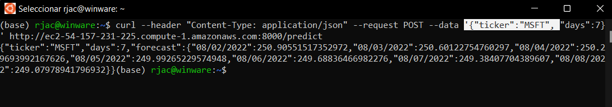
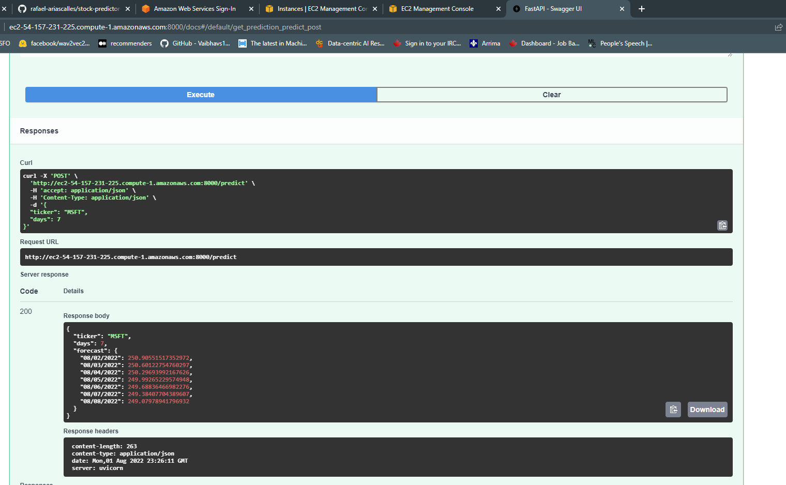

# stock-predictor-mlops
Deployment for Stock Predictor API


```bash
conda create -n stock-predictor python=3.8
```

```bash	
cd src
uvicorn main:app --reload --workers 1 --host 0.0.0.0 --port 8000
```


```bash
pip list --format=freeze > requirements_.txt
```

```bash
curl --header "Content-Type: application/json" --request POST --data '{"ticker":"MSFT", "days":7}' http://ec2-54-157-231-225.compute-1.amazonaws.com:8000/predict
```



# NExt Steps

1. Dockerize the application: this will allow to run without worring installing dependencies directly into the server. and I will be able to run the application easier and if necessary migrate to a Kubernet cluster. Also this will allow to run build a CI/CD pipeline for a Docker image instead of the code. 


## ML Discussion and Hints

1. How does the Prophet Algorithm differ from an LSTM? Prophet model is an Additive model. It takes a time serias an assume is a sum of different components. LSTM take mor einto consideration the Sequenctial and Numerical representation to the context.

2. Why does an LSTM have poor performance against ARIMA and Profit for Time Series? Becaus for LSTM it would be very difficul to capture all the components of a time series. Comonents: Trend, Seasonality, and Noise.

3. What is exponential smoothing and why is it used in Time Series Forecasting? Is a time series forecasting method that take into consideration a systematic trend and seasonality.

4. **What is stationarity?** Its a time series that is not changing and has the same variation over time. (No trend with same fluctuations). **What is seasonality?** A repeting Patterns that occurs in a certain time. **Why Is Stationarity Important in Time Series Forecasting?** Because is a necesary condition to be able to use different time series forecasting methods.


5. How is seasonality different from cyclicality? Fill in the blanks:
Seasonality is predictable, whereas cyclicality is not. (Sesonality is a repetting patter, whereas cyclicality is more variable)
